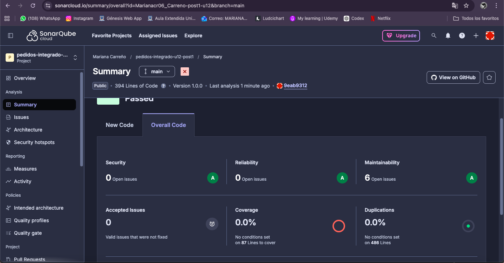
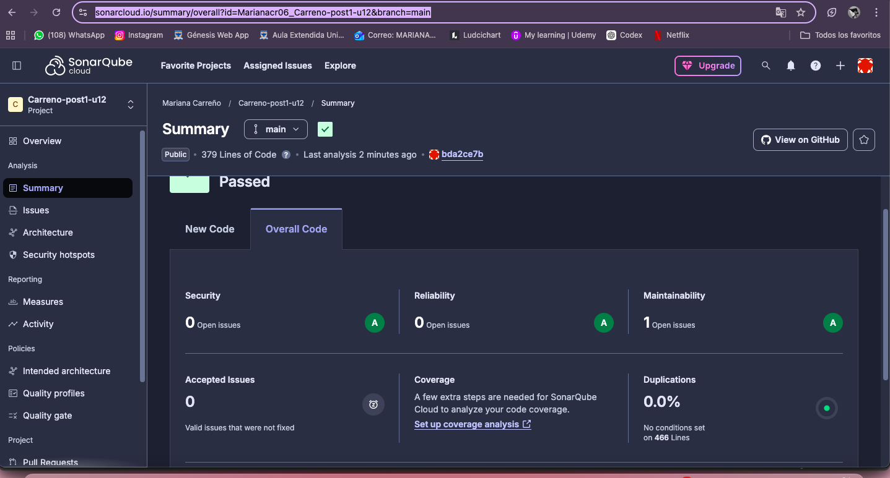

# Patrones de Diseno de Software - U12 Post 1

## Objetivo
Integrar Factory, Strategy, Observer y Facade en un sistema de pedidos, verificar desacoplamiento con pruebas y comparar metricas en SonarQube.

## Estructura
- src/main/java/com/empresa/pedidos/
- src/test/java/com/empresa/pedidos/
- img/ (capturas)

## Patrones aplicados
- Strategy: `ProcesadorPedido` y sus implementaciones por tipo.
- Factory: `ProcesadorPedidoFactory` selecciona el procesador por tipo.
- Observer: `PedidoProcesadoEvent` y listeners de notificacion.
- Facade: `FachadaPedidos` expone un flujo simple para el controlador.

---

## Tabla Comparativa de Métricas SonarCloud

| Métrica | ANTES | DESPUÉS | Mejora |
|---|---|---|---|
| Maintainability issues | 6 | 1 | ✅ -83% |
| Reliability issues | 0 | 0 | ✅ Sin cambio |
| Security issues | 0 | 0 | ✅ Sin cambio |
| Quality Gate | Passed | Passed | ✅ |

---

## Evidencias SonarCloud

### Dashboard ANTES

### Dashboard DESPUÉS

---